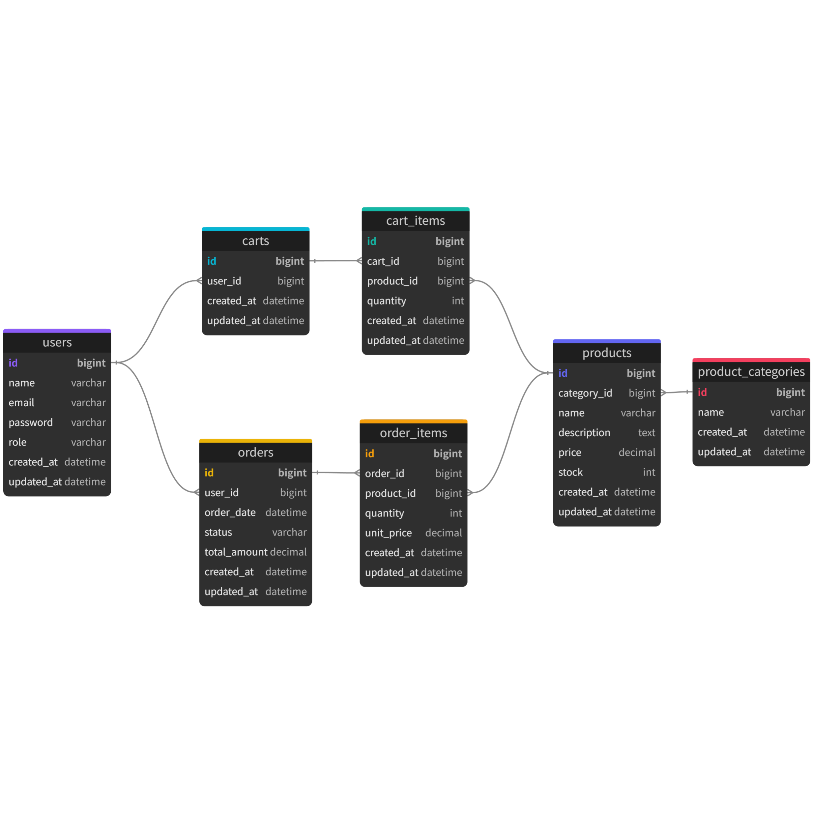

# EC1000本ノック #001
Java + Spring Boot で構築した EC サイト。
## 新しく学習、取り組んだこと
```txt
vscode + copilot でのコーディング
v0を用いたデザイン作成
wsl環境での開発

簡易的な開発フローの作成とそれに則った開発
  ユースケース(触りだけ作って断念)
  ER図の作成(schema.dbmlから作成)

コーディングなど設計
DI
AOP
DBのmigration
JOOQ
Render
Javaの監視
```
## 改善したいこと、新しく取り組みたくなったこと
①ER図をdbmlから作ると、データベースを変更するたびにdbmlと画像を修正しないといけなくなる
migrationから自動で生成するようにする
```txt
Migration
↓
DB
↓
ER図、スキーマドキュメント自動生成
```

## ユースケース
### actor
購入者
商品管理者（自分）
### use cases
#### 購入者
- 商品を探す
- 商品詳細を確認する
- 商品を注文する
#### 管理者
- 商品を管理する
- 注文を管理する
## 開発フロー
```
リポジトリ作成
TODO作成
技術選定
ユースケース整理
デザイン作成
ER図作成
素材集め
環境構築
スキーマ定義
Migration作成
API設計
Routing設計
認証設計
UIコンポーネント設計
コーディング
動作確認(手動デバッグ)
デプロイの設定
本番環境構築
デプロイ
監視・ログ設定
README修正
```
## 使用技術

### バックエンド
```txt
Java 21
Spring Boot
Spring MVC
JOOQ
Bean Validation
Spring AOP
Spring Actuator
Flyway
Lombok
Gradle
```
### フロントエンド
```txt
Thymeleaf
HTML
CSS
Tailwind CSS
JavaScript
```
### DB
```txt
PostgreSQL
```
### PaaS
```txt
Render
```
## DB
データベースのスキーマ
- [schema.dbml](./docs/schema.dbml)

## enum
### ProductStatus
ACTIVE
HIDDEN
SOLD_OUT

---

### CartStatus
ACTIVE
ORDERED
EXPIRED

---

### OrderStatus

CREATED
CANCELLED

---

### CategoryStatus

ACTIVE
HIDDEN
